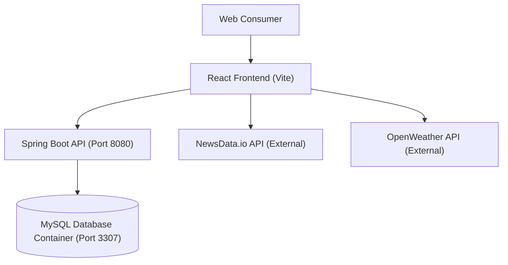
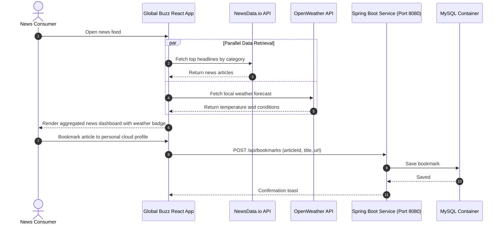

# Global Buzz Feed — Multi-Container CI/CD News Aggregator
[]()
[]()
[]()
[]()

## Overview
Global Buzz Feed is an enterprise multi-tier news and weather intelligence dashboard featuring a React/Vite client, Spring Boot backend service, MySQL database, and Docker Compose orchestration. Built with continuous integration principles, it aggregates real-time breaking news feeds and weather forecasts.

- **Problem Solved:** Multi-container CI/CD pipeline automation and live news/weather aggregation.
- **Target Users:** News consumers, media analysts, and DevOps engineers.
- **Current Status:** Multi-Container Production Build.

## Features
- **Live News Aggregation:** Real-time news category filtering powered by NewsData.io.
- **Local Weather Telemetry:** Live meteorological conditions via OpenWeather API.
- **Multi-Container Architecture:** Synchronized multi-service deployment via Docker Compose.
- **Enterprise Spring Boot Backend:** User management, bookmarks, and secure auth endpoints.

## Architecture


## User Flow


## Technology Stack
| Layer | Technology | Purpose |
|---|---|---|
| Frontend | React, Vite, Tailwind CSS, Shadcn UI | News reader UI and weather widget |
| Backend | Java 17, Spring Boot 3 | User profiles and bookmark services |
| Database | MySQL 8.0 (Containerized) | Relational persistence |
| Orchestration | Docker & Docker Compose | Multi-container coordination |

## Infrastructure
- **Frontend Port:** 5173
- **Backend Port:** 8080
- **Database Port:** 3307 (Mapped from container 3306)
- **Container Network:** Bridge network `cicd-news-network`

## Project Structure
```text
cicd-news/
├── backend/
│   ├── src/                 # Spring Boot controllers, entities, services
│   └── pom.xml              # Maven dependencies
├── frontend/
│   ├── src/
│   │   ├── services/        # newsService.ts, weatherService.ts
│   │   └── components/      # UI components and layouts
│   ├── package.json         # Frontend dependencies
│   └── vite.config.ts       # Vite configuration
├── docker-compose.yml       # Multi-container orchestration definition
├── .env.example             # Root environment template
├── .gitignore               # Git ignore definitions
└── README.md                # Technical documentation
```

## Prerequisites
- Docker Engine >= 24.0 & Docker Compose
- Node.js >= 18.x (for local frontend dev)
- JDK 17 & Maven (for local backend dev)

## Environment Variables
Create root `.env`:
```env
MYSQL_ROOT_PASSWORD=your_secure_mysql_root_password
MYSQL_DATABASE=tutordb
```
Create `frontend/.env`:
```env
VITE_NEWS_API_KEY=your_newsdata_io_api_key
VITE_OPENWEATHER_API_KEY=your_openweather_api_key
```

## Local Development Setup
1. Clone the repository:
   ```bash
   git clone https://github.com/Bhanutejanallamothu/cicd-news.git
   cd cicd-news
   ```
2. Start MySQL via Docker Compose:
   ```bash
   docker compose up -d mysql
   ```
3. Start Backend:
   ```bash
   cd backend && ./mvnw spring-boot:run
   ```
4. Start Frontend:
   ```bash
   cd ../frontend && npm install && npm run dev
   ```

## Docker Setup
Run the entire stack with Docker:
```bash
docker compose up --build -d
```
Check status:
```bash
docker compose ps
```

## Database Setup
MySQL database container initializes automatically with persistent volume `mysql_data`.

## API Documentation
- `POST /api/auth/signup` - Register user.
- `POST /api/auth/login` - Authenticate user.
- `GET /api/admin/users` - Admin user audit list.

## Deployment
Deployable via Docker Compose to any Linux VM or Kubernetes cluster.

## Security
- External API keys isolated in frontend environment variables.
- Containerized MySQL password injected via environment variables.

## Testing
Run frontend and backend tests:
```bash
cd backend && ./mvnw test
cd ../frontend && npm test
```

## Troubleshooting
- **Port 3307 in Use:** Modify host port mapping in `docker-compose.yml`.

## Future Improvements
- Automated GitHub Actions workflow to build and push Docker images to Docker Hub / GHCR.

## License
No formal open-source license provided. All rights reserved by repository owner.
