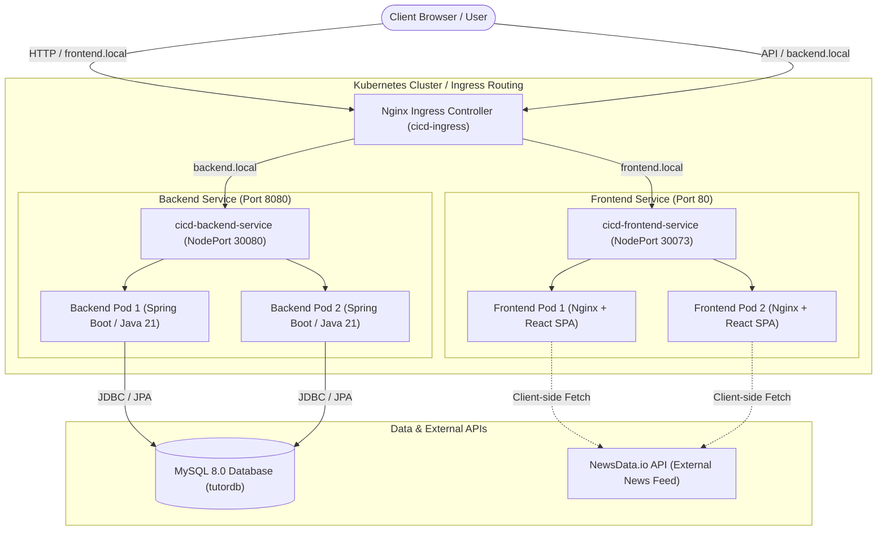
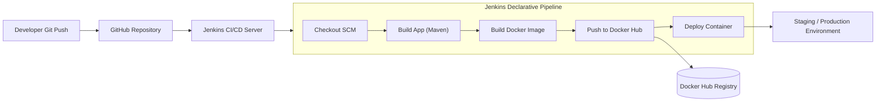

# Global Buzz Feed — Full-Stack News Portal & CI/CD Pipeline

[](https://spring.io/projects/spring-boot)
[](https://www.oracle.com/java/)
[](https://react.dev/)
[](https://www.typescriptlang.org/)
[](https://vitejs.dev/)
[](https://tailwindcss.com/)
[](https://www.docker.com/)
[](https://kubernetes.io/)
[](https://www.jenkins.io/)
[](https://www.mysql.com/)

A production-ready full-stack news application and DevOps reference architecture. This project combines a high-performance **React (Vite + TypeScript + Tailwind CSS)** frontend and a **Spring Boot 3 (Java 21)** REST backend with a containerized deployment workflow utilizing **Docker**, **Docker Compose**, **Kubernetes (K8s)**, and an automated **Jenkins CI/CD** pipeline.

---

## Table of Contents

- [Overview](#overview)
- [Architecture & Workflow](#architecture--workflow)
- [Key Features](#key-features)
- [Tech Stack](#tech-stack)
- [Repository Structure](#repository-structure)
- [Getting Started (Local Development)](#getting-started-local-development)
  - [Prerequisites](#prerequisites)
  - [Backend Setup (Spring Boot)](#backend-setup-spring-boot)
  - [Frontend Setup (React + Vite)](#frontend-setup-react--vite)
- [Containerization with Docker Compose](#containerization-with-docker-compose)
- [Kubernetes Deployment](#kubernetes-deployment)
- [CI/CD Automation (Jenkins Pipeline)](#cicd-automation-jenkins-pipeline)
- [API Reference](#api-reference)
- [Environment Configuration](#environment-configuration)
- [Contributing & License](#contributing--license)

---

## Overview

**Global Buzz Feed** delivers real-time global news coverage, live weather updates, category browsing, and article bookmarking. It demonstrates enterprise-grade software engineering best practices:

- **Separation of Concerns**: Decoupled client and server architecture communicating via typed JSON REST APIs.
- **Enterprise Backend**: Robust user registration, authentication, and role management built on Spring Boot 3, Spring Security, and Spring Data JPA with MySQL.
- **Modern Frontend**: Responsive, accessible interface constructed with Tailwind CSS and Radix UI (shadcn/ui primitives).
- **Cloud-Native DevOps**: Multi-stage Docker builds for minimal attack surfaces and compact image footprints, reproducible Docker Compose environments, declarative Kubernetes manifests with Ingress routing, and a Jenkins pipeline for continuous delivery.

---

## Architecture & Workflow

### Application Architecture



### CI/CD Delivery Pipeline



---

## Key Features

### Frontend (Global Buzz Feed)
- **Live News Feed**: Fetches real-time articles by category (business, tech, science, entertainment, health, sports) with automatic graceful fallbacks.
- **Search & Filter**: Keyword search with multi-country and language filtering options.
- **Weather Widget**: Real-time geolocation-based weather forecasts.
- **User Dashboard & Saved Articles**: Authenticated users can bookmark articles and manage reading lists stored in local storage and database.
- **Admin Portal**: Dedicated news publishing and user administration interface.
- **Responsive & Accessible UI**: Mobile-first design supporting light and dark themes using Tailwind CSS and Radix UI components.

### Backend (REST API)
- **Spring Boot 3 & Java 21**: High-performance, modern Java runtime.
- **Authentication & Authorization**: User registration, login verification, and role-based access control (`USER` vs `ADMIN`).
- **Spring Data JPA & Hibernate**: Automated schema updates and transactional persistence against MySQL.
- **HikariCP Connection Pool**: Tuned connection management with timeout resiliency for containerized databases.
- **CORS Configuration**: Explicit cross-origin allowance for development and production domains.

### DevOps & Infrastructure
- **Multi-Stage Dockerfiles**:
  - Backend: Maven compile stage $\rightarrow$ Lightweight Eclipse Temurin JRE runtime.
  - Frontend: Node 20 build stage $\rightarrow$ Production-hardened Nginx image.
- **Docker Compose**: Single-command startup with service health checks and automated dependency ordering (`mysql` $\rightarrow$ `backend` $\rightarrow$ `frontend`).
- **Kubernetes Manifests**: Multi-replica deployments (2 replicas per service), health checks, NodePort services, and domain-based Ingress routing.
- **Jenkins Pipeline**: Automated continuous integration and delivery with credential binding and Docker registry push.

---

## Tech Stack

| Domain | Technology / Library | Description |
| :--- | :--- | :--- |
| **Frontend Framework** | React 18, TypeScript, Vite 7 | Fast Single Page Application toolchain |
| **Styling & UI Components**| Tailwind CSS, shadcn/ui, Radix UI, Lucide Icons | Responsive styling and accessible UI primitives |
| **State & Data Fetching** | TanStack React Query 5, Context API | Asynchronous server-state synchronization |
| **Backend Framework** | Spring Boot 3.5.x, Java 21 | RESTful web services and enterprise framework |
| **Security & Persistence**| Spring Security, Spring Data JPA, Hibernate | Authentication filtering and ORM data layer |
| **Database** | MySQL 8.0 | Relational database management system |
| **Containerization** | Docker, Docker Compose | Multi-stage image builds and container orchestration |
| **Clustering & Orchestration** | Kubernetes (Deployments, Services, Ingress) | Container clustering, scaling, and traffic routing |
| **CI/CD Automation** | Jenkins, Docker Hub | Continuous integration, image publishing, and deployment |

---

## Repository Structure

```text
cicd-news/
├── backend/                               # Spring Boot 3 application
│   ├── src/
│   │   ├── main/
│   │   │   ├── java/com/hometutorfinder/backend/
│   │   │   │   ├── config/                # Security and Web MVC configuration
│   │   │   │   ├── controller/            # REST Controllers (Auth, Admin)
│   │   │   │   ├── model/                 # JPA Entities (User)
│   │   │   │   ├── repository/            # Spring Data JPA repositories
│   │   │   │   ├── service/               # Business logic services
│   │   │   │   └── BackendApplication.java# Main application entry point
│   │   │   └── resources/
│   │   │       └── application.properties # Spring application configuration
│   │   └── test/                          # Unit and integration tests
│   ├── Dockerfile                         # Multi-stage Docker build for backend
│   ├── pom.xml                            # Maven project descriptor
│   └── wait-for-it.sh                     # DB synchronization utility script
│
├── frontend/                              # React + Vite + TypeScript application
│   ├── public/                            # Static assets and favicons
│   ├── src/
│   │   ├── components/                    # Reusable UI widgets (Navbar, NewsCard, etc.)
│   │   ├── context/                       # Authentication and global state
│   │   ├── pages/                         # Route views (Index, Login, Signup, Dashboard)
│   │   ├── services/                      # API clients (newsService, auth, weather)
│   │   ├── App.tsx                        # Main router and provider configuration
│   │   └── main.tsx                       # React DOM root entry
│   ├── Dockerfile                         # Multi-stage Nginx Docker build
│   ├── package.json                       # Node.js dependencies and scripts
│   ├── tailwind.config.ts                 # Tailwind CSS styling tokens
│   └── vite.config.ts                     # Vite build configuration
│
├── k8s/                                   # Kubernetes production manifests
│   ├── backend-deployment.yaml            # Backend Deployment (2 replicas) & NodePort Service
│   ├── frontend-deployment.yaml           # Frontend Deployment (2 replicas) & NodePort Service
│   └── ingress.yaml                       # Ingress rules (frontend.local & backend.local)
│
├── docker-compose.yml                     # Unified multi-container composition
├── Jenkinsfile                            # Declarative CI/CD pipeline definition
└── README.md                              # Project documentation
```

---

## Getting Started (Local Development)

### Prerequisites

Ensure the following tools are installed on your workstation:
- **Java Development Kit (JDK)**: Version 21 or newer
- **Apache Maven**: Version 3.8+ (or use the included `./mvnw`)
- **Node.js**: Version 18.x or 20.x and **npm** (or Bun / Yarn)
- **MySQL Server**: Version 8.0 (running locally on port 3306 or via Docker)
- **Docker & Docker Compose**: For containerized execution
- **kubectl & Minikube / K3s** (optional): For Kubernetes testing

---

### Backend Setup (Spring Boot)

1. **Configure Database**:
   Ensure MySQL is running and create the application database:
   ```sql
   CREATE DATABASE tutordb;
   ```

2. **Update Database Credentials**:
   Adjust `backend/src/main/resources/application.properties` if your MySQL configuration differs from defaults:
   ```properties
   spring.datasource.url=jdbc:mysql://localhost:3306/tutordb?useSSL=false&allowPublicKeyRetrieval=true&serverTimezone=UTC
   spring.datasource.username=root
   spring.datasource.password=YOUR_PASSWORD
   ```

3. **Build & Run**:
   ```bash
   cd backend
   # Using Maven wrapper (Linux/macOS)
   ./mvnw spring-boot:run

   # Or on Windows PowerShell:
   .\mvnw.cmd spring-boot:run
   ```

   The backend REST API will start at: `http://localhost:8080`.

---

### Frontend Setup (React + Vite)

1. **Install Dependencies**:
   ```bash
   cd frontend
   npm install
   ```

2. **Configure Environment** *(optional)*:
   Create a `.env` file in the `frontend/` directory if you wish to override the backend API endpoint:
   ```env
   VITE_API_BASE_URL=http://localhost:8080
   ```

3. **Start the Development Server**:
   ```bash
   npm run dev
   ```

   The frontend will be accessible at: `http://localhost:5173`.

---

## Containerization with Docker Compose

Run the entire application stack (MySQL database, Spring Boot API, and React frontend) with a single command:

```bash
# Build and start all containers in detached mode
docker compose up --build -d
```

### Services Summary

| Service Name | Container Name | Port Mapping | Internal Address | Description |
| :--- | :--- | :--- | :--- | :--- |
| **mysql** | `cicd-mysql` | `3307:3306` | `mysql:3306` | MySQL 8.0 database (`tutordb`) |
| **backend** | `cicd-backend` | `8080:8080` | `backend:8080` | Spring Boot REST API |
| **frontend** | `cicd-frontend` | `5173:5173` | `frontend:5173` | React application dev server |

### Useful Docker Commands

```bash
# View real-time logs from all containers
docker compose logs -f

# View logs for a specific service
docker compose logs -f backend

# Stop all running containers and networks
docker compose down

# Stop and remove volumes (wipes database data)
docker compose down -v
```

---

## Kubernetes Deployment

The `k8s/` directory contains complete Kubernetes manifests for deploying the application on a local cluster (e.g., Minikube, Kind) or cloud provider (EKS, GKE, AKS).

### 1. Build & Push Docker Images

Before applying manifests, build and push your container images to your registry (e.g., Docker Hub):

```bash
# Build and tag images
docker build -t <your-dockerhub-user>/cicd-news-backend:latest ./backend
docker build -t <your-dockerhub-user>/cicd-news-frontend:latest ./frontend

# Authenticate and push
docker login
docker push <your-dockerhub-user>/cicd-news-backend:latest
docker push <your-dockerhub-user>/cicd-news-frontend:latest
```

> [!NOTE]
> Update the `image:` fields in `k8s/backend-deployment.yaml` and `k8s/frontend-deployment.yaml` with your image name if you are deploying custom tags.

### 2. Apply Kubernetes Manifests

```bash
# Deploy Backend Deployment and Service (NodePort 30080)
kubectl apply -f k8s/backend-deployment.yaml

# Deploy Frontend Deployment and Service (NodePort 30073)
kubectl apply -f k8s/frontend-deployment.yaml

# Deploy Ingress rules
kubectl apply -f k8s/ingress.yaml
```

### 3. Verify Deployments

```bash
# Check status of pods, services, and ingress
kubectl get pods
kubectl get svc
kubectl get ingress
```

### 4. Configure Local Ingress Hosts (Minikube / Local Testing)

If testing locally with Minikube, enable the Ingress addon:
```bash
minikube addons enable ingress
```

Retrieve the cluster ingress IP (`minikube ip`) and add the host mappings to your `hosts` file (`/etc/hosts` on Linux/macOS or `C:\Windows\System32\drivers\etc\hosts` on Windows):

```text
<MINIKUBE_IP>   frontend.local
<MINIKUBE_IP>   backend.local
```

Access the frontend via: `http://frontend.local`  
Access the backend via: `http://backend.local/api/auth/users`

---

## CI/CD Automation (Jenkins Pipeline)

The project includes a declarative `Jenkinsfile` configured to automate testing, image building, registry publishing, and container deployment upon code commits.

### Pipeline Stages

1. **Checkout**: Pulls the latest commit from the `main` branch on GitHub.
2. **Build App**: Compiles the Spring Boot artifact using Maven (`mvn clean package -DskipTests`).
3. **Build Docker Image**: Constructs the Docker container tagged as `${IMAGE_NAME}:${DOCKER_TAG}`.
4. **Push Docker Image**: Authenticates with Docker Hub via Jenkins stored credentials (`docker-hub-credentials`) and pushes the latest image.
5. **Deploy Container**: Stops any active container and runs the newly updated container image on the deployment target.

### Setting Up Jenkins

1. Create a new **Pipeline** job in your Jenkins dashboard.
2. Configure **Pipeline Definition**: Select *Pipeline script from SCM*, choose *Git*, and supply your repository URL.
3. Add Docker Hub Credentials:
   - Go to **Manage Jenkins** $\rightarrow$ **Credentials** $\rightarrow$ **System** $\rightarrow$ **Global credentials**.
   - Add a *Username with password* credential.
   - Set **ID** to `docker-hub-credentials`.
4. Trigger the pipeline via webhook on push or run **Build Now**.

---

## API Reference

### Authentication Endpoints (`/api/auth`)

#### 1. Register User
- **Method**: `POST`
- **Endpoint**: `/api/auth/signup`
- **Request Body**:
  ```json
  {
    "name": "Jane Doe",
    "email": "jane@example.com",
    "password": "securepassword123",
    "role": "user"
  }
  ```
- **Response** (`200 OK`):
  ```json
  {
    "id": 1,
    "name": "Jane Doe",
    "email": "jane@example.com",
    "role": "user",
    "status": "ACTIVE"
  }
  ```

#### 2. User Login
- **Method**: `POST`
- **Endpoint**: `/api/auth/login`
- **Request Body**:
  ```json
  {
    "email": "jane@example.com",
    "password": "securepassword123"
  }
  ```
- **Response** (`200 OK`):
  ```json
  {
    "id": 1,
    "name": "Jane Doe",
    "email": "jane@example.com",
    "role": "user",
    "status": "ACTIVE"
  }
  ```

#### 3. List All Users
- **Method**: `GET`
- **Endpoint**: `/api/auth/users`
- **Response** (`200 OK`): List of registered user records.

---

### Admin Endpoints (`/api/admin`)

#### 1. Admin Authentication
- **Method**: `POST`
- **Endpoint**: `/api/admin/login`
- **Request Body**:
  ```json
  {
    "email": "admin",
    "password": "admin123"
  }
  ```
- **Response** (`200 OK`):
  ```json
  {
    "message": "Admin login successful",
    "token": "d8e3b5e4-2391-4cf5-9920-5c6218d6bc9f",
    "role": "ADMIN"
  }
  ```

#### 2. Admin User Directory
- **Method**: `GET`
- **Endpoint**: `/api/admin/users`
- **Response** (`200 OK`): Complete user list with administrative metadata.

---

## Environment Configuration

| Variable | Scope | Default Value | Description |
| :--- | :--- | :--- | :--- |
| `SPRING_DATASOURCE_URL` | Backend | `jdbc:mysql://localhost:3306/tutordb` | JDBC connection string |
| `SPRING_DATASOURCE_USERNAME` | Backend | `root` | Database username |
| `SPRING_DATASOURCE_PASSWORD` | Backend | `Kitler@110` | Database password |
| `SPRING_JPA_HIBERNATE_DDL_AUTO` | Backend | `update` | Hibernate schema lifecycle strategy |
| `VITE_API_BASE_URL` | Frontend | `http://localhost:8080` | Base URL for backend REST API |
| `NODE_ENV` | Frontend | `development` / `production` | Node execution environment |
| `MYSQL_ROOT_PASSWORD` | Docker MySQL | `Kitler@110` | Root password for MySQL container |
| `MYSQL_DATABASE` | Docker MySQL | `tutordb` | Target database initialized on boot |

---

## Contributing & License

1. Fork the repository and create a feature branch (`git checkout -b feature/amazing-feature`).
2. Commit your modifications with descriptive commit messages (`git commit -m 'feat: add amazing feature'`).
3. Push to your branch (`git push origin feature/amazing-feature`).
4. Open a Pull Request for review.

Developed with modern CI/CD practices and clean architecture principles.
